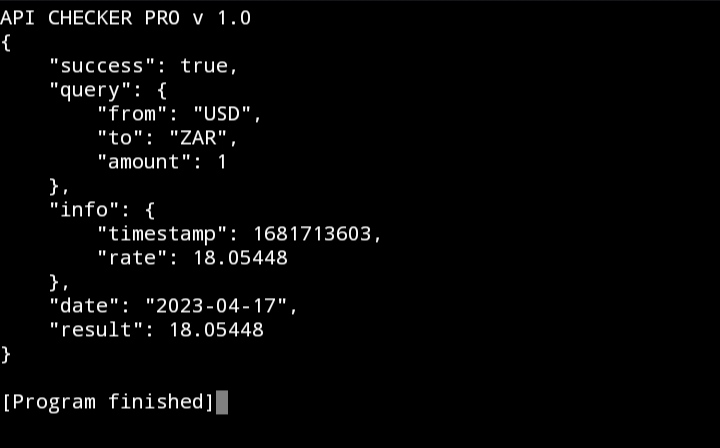

# SwapCentral
An API powered exchange rates C program that provides real-time exchange rates and written purely in C

How to use :

Make an account at apilayer.com
Insert API After "Key" in program

Run it 
